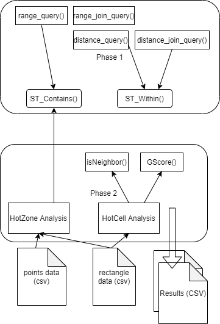
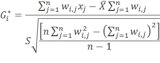

# SpatialDataAnalysis

Geo-Spatial data analysis requires understanding of both big-data and the structures of Geo-Spatial data. In this project, we have analyzed one such geo-spatial dataset which represents data collected by a major peer-to-peer taxi cab company. We have performed different operations using with the help of SparkSQL and finally get some specific analysis results for identifying Hot-zones and Hotcells in the provided data.

## Overview of the Project

We have used *Apache Spark* as the big data analysis tool. Code is written in Scala and a jar file is created which is similar to jar file we create from Java projects. This jar file is then submitted to Apache Spark for distributed processing. The path to input data file (CSV format) and the output folder path can be specified in command line arguments while submitting the jar file to Spark. The codebase extensively uses SparkSQL to implement the steps of each task, each step generates a new RDD or performs an operation to reduce an existing RDD. There is extensive usage of user-defined functions to simplify the SQL command and provide a higher level of expression.

## Environment Setup

Setting up the Development Environment We have used Scala to write the code for Spark with SBT as the build tool and IntelliJ as the IDE.

1. Softwares and Path Setup: We have installed JDK 1.8.0, Scala-SBT, Apache-Spark and Winutils and then set up JAVA HOME, SBT HOME, SPARK HOME and HADOOP PATH in the system environment following the tutorial. Intellij along with various plugins for scala and sbt was used as an IDE.

2. Submitting the code to spark: in the project root folder, running ’sbt assembly’ command gives us the jar file. Now, this jar file can be tested using local spark installation using ‘spark-submit’ command.

## Overall System Diagram

## Phase 1 Implementation Details

In the first phase, we have primarily written code to solve 2 problems:

1. **Defining ST_Contains**: For this problem, the inputs are a geospatial point and four other points that define a rectangle. Given those inputs, ST Contains is supposed to determine whether the given single point lies within that rectangle. We get the inputs in the form of two strings. In response, this function will return either true or false. In order to solve this, we first extract the coordinates for the point and the rectangle from the string inputs and compare them to determine whether that point lies within the rectangle.
2. **Defining ST_Within**: For this problem, we are given two geospatial points and a distance value (in km), this function returns whether the points are within the given distance from each other. Similar to the previous one, the input points are in string format of the coordinates which we needed parse inside the function. After parsing the coordinates, we take euclidean distance between the coordinates, then compare the distance with the given input distance.

Once these two functions are done, the following spatial queries were easy to implement (which was actually defined in the template code provided by the course instructor).

- Range query, given a query rectangle R and set of points P , find all the points within R
- Range Join, using ST CONTAINS function , given a set of rectangles R and a set of points P all the points within R are found.
- Distance query, using ST WITHIN , In a given fixed location P and distance D , all the points that lie within a distance D from P
- Distance Join , given a set of Points S1 and a set of Points S2 and a distance D in km, find all (s1, s2) pairs such that s1 is within a distance D from s2 (i.e., s1 belongs to S1 and s2 belongs to S2).

## Phase 2 Implementation Details

The second phase is about solving two other problems: hotzone analysis and hotcell analysis with the given data. From the provided template, we got the code for reading and parsing the input csv files. In hotzone analysis we have written the part for joining and aggregating and in hotcell analysis we have written the code for finding value of the average, standard deviation and G-Score for the given data. Besides the defined functions in the given template, we also needed to write some utility functions in order to perform these two tasks.

1. **Hot Zone Analysis**: The input to this function are two paths, one for the file containing points and the other one containing the rectangles. We load both of these files and parse the points and rectangles in two different dataframes namely ’point’ and ’rectangle’. Then with sparkSQL we join these two dataframes with the help of ST Contains function to determine whether a point is within the given rectangle. Finally we get a dataframe with each rectangle (group by) and the count of points in each of them. This is  lso done with SparkSQL query. The final result is then sorte based on the hotness of each of the rectangles.

Pseudocode for hot zone analysis:
- Parse CSV file and get dataframes for points and rectangles.
- Define the function ‘ST Contains’ as described in Phase above
- Join rectangle and point dataframes and check if the ST_Contains method defined above returns true.
- Perform a group-by and then count on the resulting dataframe from above step.
- Sort based on the count of points for each rectangle.

2. **Hot Cell Analysis**: This task applies spatial statistics to spatio-temporal big data in order to identify statistically significant spatial hot spots using Apache Spark. For Hotcell analysis, the provided template already gave us the code to parse the coordinates of the taxi trips and a DataFrame containing those results. A “cell” is a term used to describe a combination of latitude,longitude and date(0-31), thus a cell is a spatio-temporal structure. We also got the total number of cells from the provided code. Based on that, we have written the rest of the code to find out the list of the top 50 “hottest” cells , ie the cells with the max value of the Getis-Ord(G-star) statistic. The equation for GScore calculation is given below:

Our approach for the solution is as follows:
- We have performed a group-by operation on the cells based on their coordinates (X, Y, Z) and counted the number of points under each of the cells. We named this dataframe “Cells”.
- Then, using SQL join on this dataframe ‘Cells’ with itself and using the function “isNeighbour” we obtained the sum of the number of points in adjacent cells (Wi,j , Xj), and the count of adjacent cells (Wi,j). We name this new
dataframe “Neighbor”.
- Now, we average (X) and standard deviation (S) from
‘Cells’ using an SparkSQL query with aggregate function
sum and then using the total number of cells.
- Now, from the dataframe “Neighbor”, calling the user defined function ‘g score’, we get the final G-Score for each cell. Then we sort and return top 50 results from this dataframe.

The isNeighbour function takes as input the coordinates of 2 cells and returns true if the 2 cells are neighbours. This is checked using the X, Y, Z coordinates and getting values one step away from each one of them. G score function takes the total number of neighbours, mean and standard deviation and then calculate the G* value for each cell based on equation 2. The overall system is visualized in Figure 1

## References

- [1] Spark development setup and installation instructions, Tutorialspoint, https://www.tutorialspoint.com/spark_sql/spark_installation.htm
- [2] ACM SIGSPATIAL GISCUP 2016. Problem statement, http://sigspatial2016.sigspatial.org/giscup2016/problem
- [3] Winutils For windows, https://github.com/cdarlint/winutils

### Authors

This project is a part of the project done for CSE 511: Data Processing at Scale Project Spring 2021, at Arizona State University.

Group 20 Team members:
- Dhrithi Chidananda
- Saurabh Gaggar
- Gautham Krishna
- Yashaswi Pochampally
- Chandraveer Singh
- Tariq M Nasim

## phase-1
 - Implement ST_Contains and ST_Within

## phase-2
 - HotSpot analysis